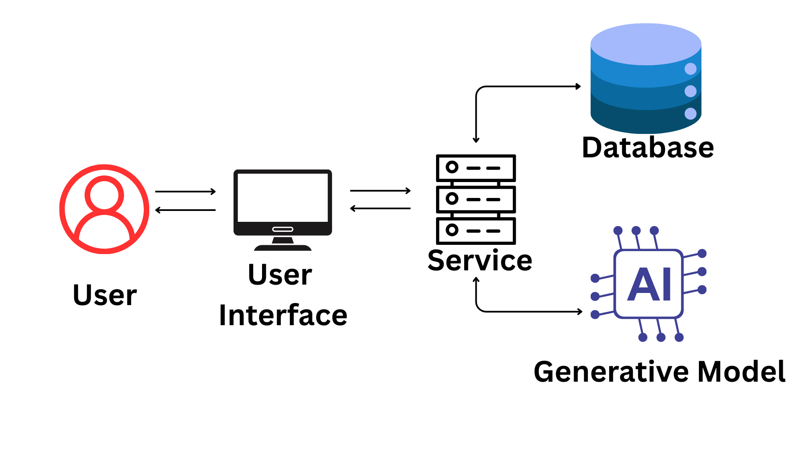
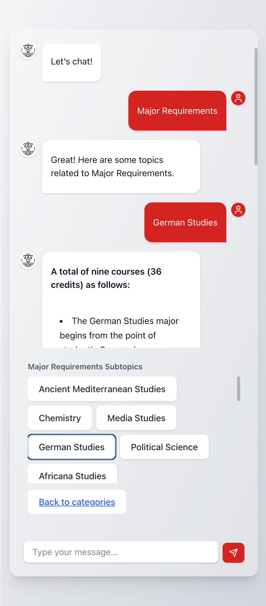
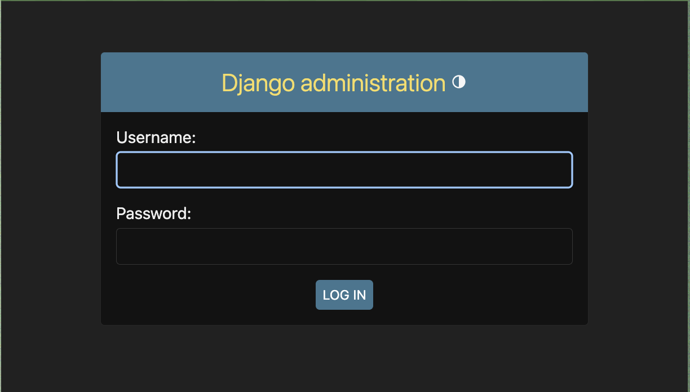

# Lynx CatBot

## Project Description

Lynx CatBot is an intelligent web-based chatbot assistant built to support new and prospective students at Rhodes College. It is designed to provide concise, accurate, and approachable answers to questions about academics, student life, housing, and more. Built with a React frontend and Django backend, the chatbot integrates dynamic AI-generated responses with a curated FAQ knowledge base to offer a robust and user-friendly support experience.

### Key Features

- **Interactive Chat Interface** with animated transitions and quick-suggestion buttons.
- **AI-Powered Responses** using Gemini 2.0 Flash for semantic search and natural language generation.
- **Categorical Question Handling** powered by curated datasets for reliable quick answers.
- **Backend Admin Panel** for managing questions and answers.
- **Dockerized Deployment** for local and remote scalability.

### 🖥️ System Diagram

 <!-- Replace with your actual image path -->


### Example Run

 <!-- Replace with your actual screenshot -->
 <!-- Replace with your actual screenshot -->

---

## 🧩 Project Dependencies

### ⚙️ Software Libraries

#### Frontend:
- React
- TypeScript
- TailwindCSS
- Axios
- Framer Motion

#### Backend:
- Python 3.10+
- Django
- Django REST Framework
- Google Generative AI SDK (`google-generativeai`)

### ☁️ Runtime Environments
- Docker
- Docker Compose

### 🗄️ Backend Services
- **Database**: PostgreSQL
- **AI Service**: Gemini 2.0 Flash ([Get API key here](https://makersuite.google.com/app/apikey))

---

## 🚀 Quick Start Guide

### 🛠️ Installation Instructions

Clone the repository:

```bash
git clone https://github.com/Rhodes-CS-comp486/lynx-catbot.git
cd lynx-catbot

```